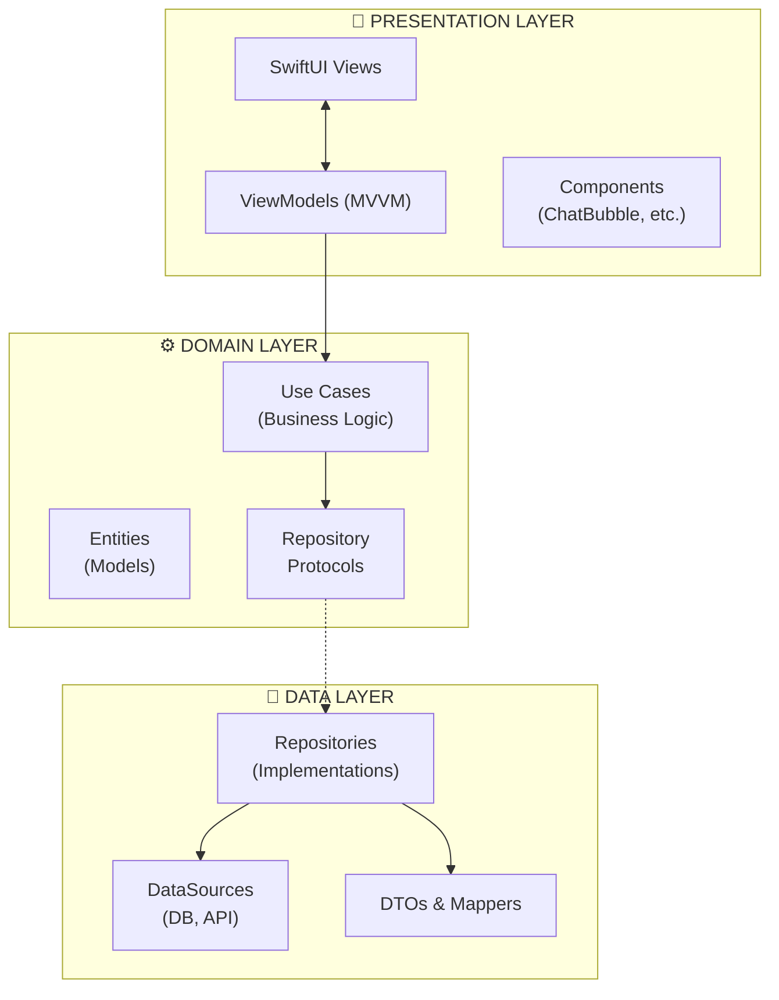
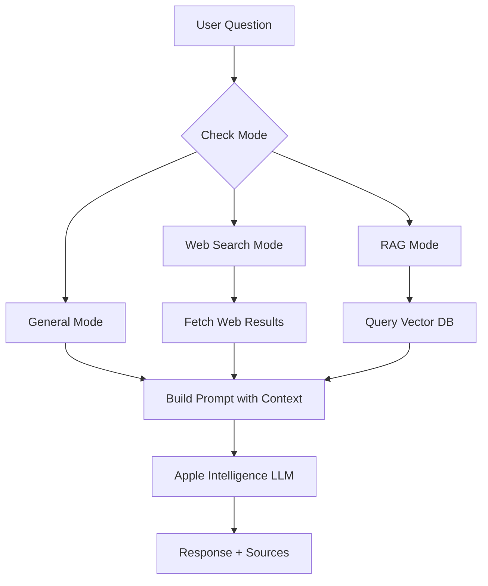
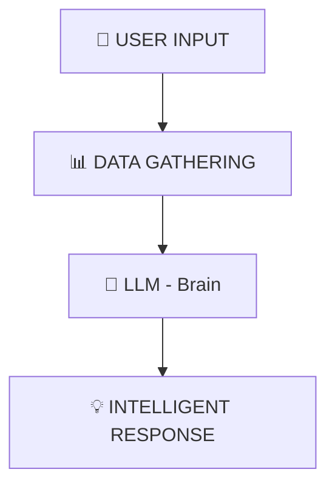

# letstalkAI

A privacy-focused AI chat assistant for **iOS & macOS**, powered by **Apple Intelligence** and **Local LLMs (MLX)**. All AI processing happens on-device for maximum privacy and security.

[](https://developer.apple.com)
[](https://swift.org)
[](https://github.com/ml-explore/mlx-swift)
[](LICENSE)

## Features

### Core Features
- **On-Device AI** - Dual engine support: Apple Intelligence + Local LLMs (MLX)
- **Local LLM Models** - Download and run open-source models (Llama, Qwen, Gemma) locally
- **Cross-Platform** - Native support for both iOS and macOS
- **RAG (Retrieval-Augmented Generation)** - Upload PDFs and documents for context-aware responses
- **Web Search Integration** - Real-time web search using DuckDuckGo with source citations
- **Voice Conversations** - Full speech-to-text (STT) and text-to-speech (TTS) support
- **Multiple Chat Sessions** - Manage conversations with auto-generated titles
- **Knowledge Base** - Build a personal knowledge base from uploaded documents
- **Model Management** - Browse, download, and manage local LLM models

### UI/UX Features
- **Dark/Light Mode** - System-aware theme support
- **Markdown Rendering** - Rich text formatting in AI responses
- **Listen Button** - Text-to-speech for any AI message
- **Source Citations** - View and open web sources directly
- **Haptic Feedback** - Tactile feedback for interactions (iOS & macOS trackpad)
- **Native Experience** - Platform-specific optimizations for iOS and macOS

## System Requirements

### iOS

| Requirement | Minimum |
|-------------|---------|
| iOS Version | 18.0+ (26.0+ for FoundationModels) |
| Xcode | 16.0+ |
| Swift | 6.0+ |
| Device | iPhone 15 Pro or newer (for Apple Intelligence) |

### macOS

| Requirement | Minimum |
|-------------|---------|
| macOS Version | 15.0 Sequoia+ (26.0+ for FoundationModels) |
| Xcode | 16.0+ |
| Swift | 6.0+ |
| Hardware | Apple Silicon Mac (M1, M2, M3, M4 or newer) |

### Important Notes

> **AI Engine Options:**
> 
> | Engine | Availability | Requirements |
> |--------|--------------|--------------|
> | Apple Intelligence | iOS 26+, macOS 26+ | iPhone 15 Pro+, Mac M1+ with AI enabled |
> | Local LLMs (MLX) | iOS 18+, macOS 15+ | Any Apple Silicon device |
> 
> **Without Apple Intelligence**, the app automatically uses **Local LLMs** if a model is downloaded.
> 
> **Simulator Limitation**: Both Apple Intelligence and MLX require Apple Silicon. Use a physical device for testing.

## Architecture

This project follows **Clean Architecture** principles with **MVVM** pattern:



### Project Structure

```
letstalkAI/
├── App/                          # App entry point
│   ├── LetsTalkAIApp.swift      # Main app entry
│   ├── DependencyContainer.swift # Dependency injection
│   └── Info.plist               # App configuration
│
├── Domain/                       # Business logic (pure Swift)
│   ├── Entities/                # Core data models
│   │   ├── ChatSession.swift
│   │   ├── ChatMessage.swift
│   │   ├── Document.swift
│   │   └── WebSearchResult.swift
│   ├── UseCases/                # Business operations
│   │   ├── Chat/
│   │   ├── Session/
│   │   ├── RAG/
│   │   ├── WebSearch/
│   │   └── Voice/
│   └── Repositories/            # Repository protocols
│
├── Data/                         # Data layer
│   ├── Repositories/            # Repository implementations
│   │   ├── ChatRepository.swift
│   │   ├── LLMRepository.swift
│   │   ├── RAGRepository.swift
│   │   └── SpeechRepository.swift
│   ├── DataSources/
│   │   ├── Local/
│   │   │   ├── DatabaseManager.swift    # SQLite
│   │   │   ├── VectorDatabaseManager.swift # SVDB
│   │   │   └── FileStorageManager.swift
│   │   └── Remote/
│   │       └── WebScrapingService.swift # DuckDuckGo
│   ├── DTOs/                    # Data Transfer Objects
│   └── Mappers/                 # Entity <-> DTO mappers
│
├── Presentation/                 # UI layer
│   ├── ViewModels/
│   │   ├── ChatViewModel.swift
│   │   ├── SessionListViewModel.swift
│   │   ├── VoiceConversationViewModel.swift
│   │   └── KnowledgeBaseViewModel.swift
│   └── Views/
│       ├── Chat/
│       ├── Sidebar/
│       ├── Voice/
│       ├── Documents/
│       ├── Settings/
│       ├── Onboarding/
│       └── Components/
│
├── Infrastructure/               # Cross-cutting concerns
│   └── Utilities/
│       ├── HapticFeedback.swift
│       └── NetworkConnectivity.swift
│
└── Resources/                    # Assets
```

## How It Works

### AI Response Flow



### What the LLM (Apple Intelligence) Does



<table>
<tr>
<td width="100%">

**📝 USER INPUT**
```
"What is quantum computing?"
```

</td>
</tr>
<tr>
<td>

**📊 DATA GATHERING**
| Source | Description |
|--------|-------------|
| 🌐 Web Search | Real-time search results from DuckDuckGo |
| 📄 Documents | Your uploaded PDFs and files (RAG) |
| 💬 Chat History | Previous conversation context |

</td>
</tr>
<tr>
<td>

**🧠 LLM (Brain) - What it does:**
- Understands the question
- Processes all gathered data
- Generates intelligent, coherent response
- Remembers conversation context
- Synthesizes information from multiple sources

</td>
</tr>
<tr>
<td>

**💡 INTELLIGENT RESPONSE**
```
"Quantum computing uses quantum mechanics principles like superposition 
and entanglement to process information. Unlike classical computers 
that use bits (0 or 1), quantum computers use qubits which can exist 
in multiple states simultaneously..."
```

</td>
</tr>
</table>

> **Note**: Without Apple Intelligence (e.g., on simulator), the app displays raw web search results as a fallback instead of synthesized responses.

### Key Components

| Component | Technology | Purpose |
|-----------|------------|---------|
| LLM (Cloud) | Apple FoundationModels | Generate intelligent responses |
| LLM (Local) | MLX-Swift | Run open-source models on-device |
| Vector DB | SVDB | Store document embeddings for RAG |
| Database | SQLite.swift | Persist chat sessions and messages |
| Web Search | DuckDuckGo + SwiftSoup | Fetch and parse web content |
| Speech | SFSpeechRecognizer + AVSpeechSynthesizer | Voice input/output |
| Embeddings | NLEmbedding | Generate text vectors for RAG |

## Local LLM Models (MLX)

### Supported Models

| Model | Size | Recommended Device |
|-------|------|-------------------|
| Llama 3.2 (1B) | ~600MB | iPhone 14+, Any Mac M1+ |
| Llama 3.2 (3B) | ~1.5GB | iPhone 15 Pro+, Mac M1+ |
| Qwen 3.5 (0.8B) | ~500MB | iPhone 14+, Any Mac M1+ |
| Qwen 3.5 (3B) | ~1.5GB | iPhone 15 Pro+, Mac M1+ |
| Gemma 3 (2B) | ~1GB | iPhone 15+, Mac M1+ |
| Phi 4 Mini | ~2GB | iPhone 15 Pro+, Mac M1+ |

### How Local LLMs Work

```
┌─────────────────────────────────────────────────────────┐
│                    YOUR DEVICE                          │
│                                                         │
│  ┌─────────────┐    ┌─────────────┐    ┌─────────────┐  │
│  │  Model File │ →  │  MLX Engine │ →  │  Response   │  │
│  │  (500MB-4GB)│    │ (Apple GPU) │    │  (Text)     │  │
│  └─────────────┘    └─────────────┘    └─────────────┘  │
│                                                         │
│  ✅ No internet needed after download                   │
│  ✅ Data never leaves device                            │
│  ✅ Works in airplane mode                              │
└─────────────────────────────────────────────────────────┘
```

### Enabling Local LLMs

1. Go to **Settings → Manage Models**
2. Browse available model families (Llama, Qwen, Gemma, etc.)
3. Download a model (one-time, requires internet)
4. Select the model to use
5. Chat offline with local AI!

### Developer Mode

For development/testing, you can use placeholder mode:

1. Go to **Settings → Developer**
2. Toggle **"Real MLX Downloads"**:
   - **OFF** (default): Placeholder mode - instant downloads, keyword-based responses
   - **ON**: Real MLX - downloads actual models, real AI inference

## Dependencies

| Package | Version | Purpose |
|---------|---------|---------|
| [SQLite.swift](https://github.com/stephencelis/SQLite.swift) | 0.15.0+ | Local database persistence |
| [SVDB](https://github.com/Dripfarm/SVDB) | 2.0.0+ | Vector database for RAG |
| [SwiftSoup](https://github.com/scinfu/SwiftSoup) | 2.7.0+ | HTML parsing for web scraping |
| [MarkdownUI](https://github.com/gonzalezreal/swift-markdown-ui) | 2.4.0+ | Markdown rendering in chat |
| [mlx-swift-lm](https://github.com/ml-explore/mlx-swift-lm) | 3.31.0+ | Local LLM inference on Apple Silicon |

## Getting Started

### Prerequisites

1. **Xcode 16+** installed
2. **Apple Developer Account** (for device deployment)
3. **For iOS**: iPhone 15 Pro or newer with Apple Intelligence enabled
4. **For macOS**: Apple Silicon Mac (M1+) with Apple Intelligence enabled

### Installation

1. **Clone the repository**
   ```bash
   git clone https://github.com/iOSRajaramMohanty/letstalkAI.git
   cd letstalkAI
   ```

2. **Generate Xcode project** (if using XcodeGen)
   ```bash
   xcodegen generate
   ```

3. **Open in Xcode**
   ```bash
   open letstalkAI.xcodeproj
   ```

### Building for iOS

1. Select the **letstalkAI** scheme
2. Choose your iOS device (not simulator)
3. Press `Cmd+R` to build and run

### Building for macOS

1. Select the **letstalkAI-macOS** scheme
2. Press `Cmd+R` to build and run

### Available Schemes

| Scheme | Platform | Description |
|--------|----------|-------------|
| `letstalkAI` | iOS | Main iOS app |
| `letstalkAI-macOS` | macOS | Native macOS app |
| `letstalkAITests` | iOS | Unit tests for iOS |
| `letstalkAITests-macOS` | macOS | Unit tests for macOS |

4. **Configure signing**
   - Select the `letstalkAI` target
   - Go to Signing & Capabilities
   - Select your development team

5. **Build and run**
   - Select a physical device (not simulator)
   - Press `Cmd+R` to build and run

### Enabling Apple Intelligence

1. Go to **Settings** on your iPhone
2. Navigate to **Apple Intelligence & Siri**
3. Enable **Apple Intelligence**
4. Wait for models to download

## Usage

### Chat Mode
- Type messages to chat with AI
- Responses are generated on-device using Apple Intelligence

### Web Search Mode
- Tap the **globe icon** to enable web search
- AI will search the web and cite sources
- Tap **Sources** to view/open referenced websites

### Knowledge Base
- Tap the **document icon** to upload PDFs
- AI will use uploaded documents as context
- Great for Q&A about specific documents

### Voice Mode
- Tap the **microphone icon** for voice conversation
- Speak naturally - AI will respond with voice

## Testing

### Run All Tests
```bash
xcodebuild test \
  -project letstalkAI.xcodeproj \
  -scheme letstalkAI \
  -destination 'platform=iOS Simulator,name=iPhone 16 Pro'
```

### Test Categories

| Type | Location | Coverage |
|------|----------|----------|
| Unit Tests | `letstalkAITests/` | Use Cases, ViewModels, Mappers |
| Integration Tests | `letstalkAIIntegrationTests/` | Repositories with in-memory DB |
| UI Tests | `letstalkAIUITests/` | Critical user flows |

## Troubleshooting

### "Apple Intelligence is not available"
- **Cause**: Running on simulator or unsupported device
- **Solution**: Use iPhone 15 Pro or newer with Apple Intelligence enabled

### "No such module 'SQLite'" or similar
- **Cause**: SPM packages not resolved
- **Solution**: 
  1. File → Packages → Reset Package Caches
  2. File → Packages → Resolve Package Versions

### Web search returns no results
- **Cause**: Network connectivity or DuckDuckGo rate limiting
- **Solution**: Check internet connection, wait and retry

### Voice recognition not working
- **Cause**: Microphone permission denied
- **Solution**: Grant microphone permission in Settings → letstalkAI

## Contributing

1. Fork the repository
2. Create a feature branch (`git checkout -b feature/amazing-feature`)
3. Commit your changes (`git commit -m 'Add amazing feature'`)
4. Push to the branch (`git push origin feature/amazing-feature`)
5. Open a Pull Request

## License

MIT License - see [LICENSE](LICENSE) file for details.

## Acknowledgments

- [Apple FoundationModels](https://developer.apple.com/documentation/foundationmodels) - On-device AI
- [MLX](https://github.com/ml-explore/mlx) - Apple's machine learning framework
- [mlx-swift-lm](https://github.com/ml-explore/mlx-swift-lm) - Swift LLM inference
- [SVDB](https://github.com/Dripfarm/SVDB) - Vector database
- [SwiftSoup](https://github.com/scinfu/SwiftSoup) - HTML parsing
- [MarkdownUI](https://github.com/gonzalezreal/swift-markdown-ui) - Markdown rendering
- [Hugging Face](https://huggingface.co/mlx-community) - MLX model repository
