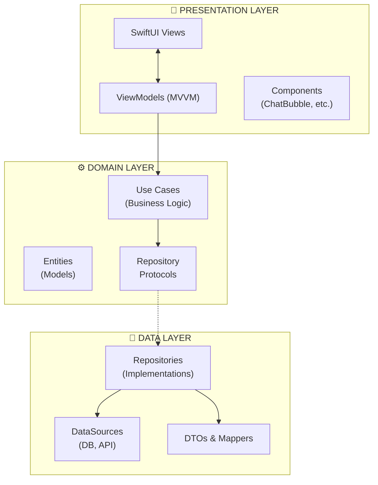
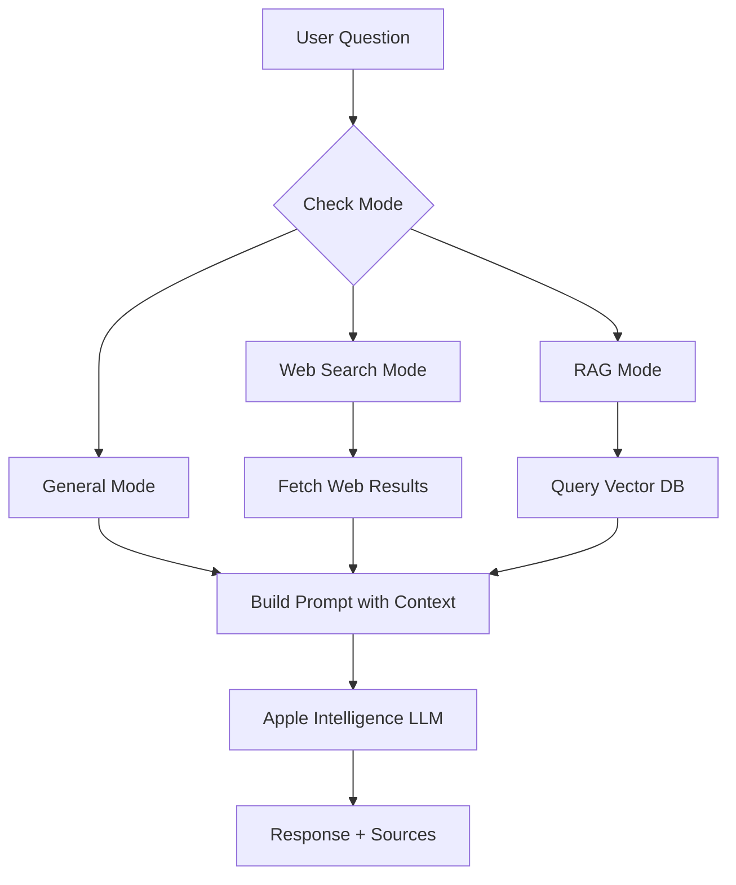
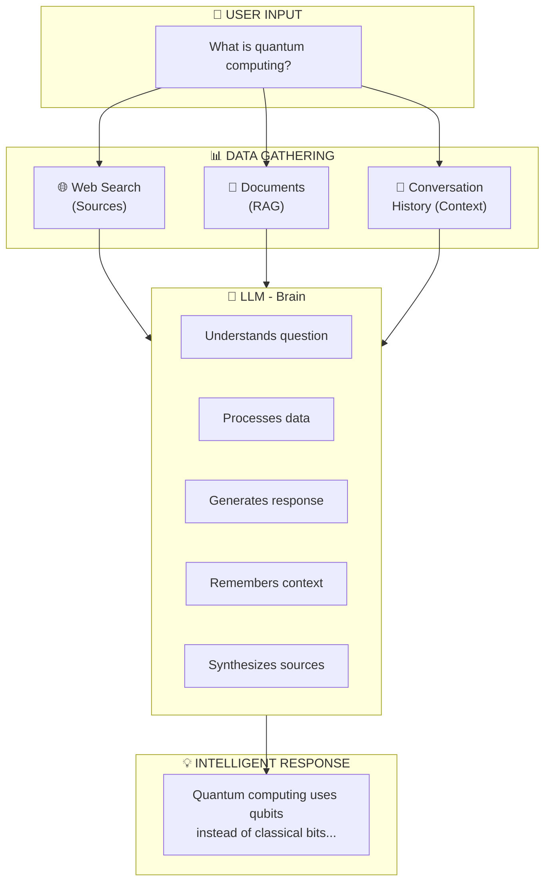

# letstalkAI

A privacy-focused AI chat assistant for iOS, powered by **Apple Intelligence (FoundationModels)**. All AI processing happens on-device for maximum privacy and security.

## Features

### Core Features
- **On-Device AI** - Powered by Apple FoundationModels (iOS 26+), all AI processing happens locally
- **RAG (Retrieval-Augmented Generation)** - Upload PDFs and documents for context-aware responses
- **Web Search Integration** - Real-time web search using DuckDuckGo with source citations
- **Voice Conversations** - Full speech-to-text (STT) and text-to-speech (TTS) support
- **Multiple Chat Sessions** - Manage conversations with auto-generated titles
- **Knowledge Base** - Build a personal knowledge base from uploaded documents

### UI/UX Features
- **Dark/Light Mode** - System-aware theme support
- **Markdown Rendering** - Rich text formatting in AI responses
- **Listen Button** - Text-to-speech for any AI message
- **Source Citations** - View and open web sources directly
- **Haptic Feedback** - Tactile feedback for interactions

## System Requirements

| Requirement | Minimum |
|-------------|---------|
| iOS Version | 26.0+ |
| Xcode | 16.0+ |
| Swift | 6.0+ |
| Device | iPhone 15 Pro or newer (for Apple Intelligence) |

### Important Notes

> **Apple Intelligence is required** for full functionality. Without it:
> - The app cannot generate AI responses
> - Web search will show raw results without summarization
> - Conversation memory/context is not available
> 
> **Simulator Limitation**: Apple Intelligence is NOT available on iOS Simulator. You must test on a physical device with Apple Intelligence enabled.

## Architecture

This project follows **Clean Architecture** principles with **MVVM** pattern:



### Project Structure

```
letstalkAI/
├── App/                          # App entry point
│   ├── LetsTalkAIApp.swift      # Main app entry
│   ├── DependencyContainer.swift # Dependency injection
│   └── Info.plist               # App configuration
│
├── Domain/                       # Business logic (pure Swift)
│   ├── Entities/                # Core data models
│   │   ├── ChatSession.swift
│   │   ├── ChatMessage.swift
│   │   ├── Document.swift
│   │   └── WebSearchResult.swift
│   ├── UseCases/                # Business operations
│   │   ├── Chat/
│   │   ├── Session/
│   │   ├── RAG/
│   │   ├── WebSearch/
│   │   └── Voice/
│   └── Repositories/            # Repository protocols
│
├── Data/                         # Data layer
│   ├── Repositories/            # Repository implementations
│   │   ├── ChatRepository.swift
│   │   ├── LLMRepository.swift
│   │   ├── RAGRepository.swift
│   │   └── SpeechRepository.swift
│   ├── DataSources/
│   │   ├── Local/
│   │   │   ├── DatabaseManager.swift    # SQLite
│   │   │   ├── VectorDatabaseManager.swift # SVDB
│   │   │   └── FileStorageManager.swift
│   │   └── Remote/
│   │       └── WebScrapingService.swift # DuckDuckGo
│   ├── DTOs/                    # Data Transfer Objects
│   └── Mappers/                 # Entity <-> DTO mappers
│
├── Presentation/                 # UI layer
│   ├── ViewModels/
│   │   ├── ChatViewModel.swift
│   │   ├── SessionListViewModel.swift
│   │   ├── VoiceConversationViewModel.swift
│   │   └── KnowledgeBaseViewModel.swift
│   └── Views/
│       ├── Chat/
│       ├── Sidebar/
│       ├── Voice/
│       ├── Documents/
│       ├── Settings/
│       ├── Onboarding/
│       └── Components/
│
├── Infrastructure/               # Cross-cutting concerns
│   └── Utilities/
│       ├── HapticFeedback.swift
│       └── NetworkConnectivity.swift
│
└── Resources/                    # Assets
```

## How It Works

### AI Response Flow



### What the LLM (Apple Intelligence) Does



**LLM Capabilities:**

| Capability | Description |
|------------|-------------|
| **Intelligent Responses** | Generates natural, context-aware answers to user questions |
| **Context Understanding** | Maintains conversation memory across chat sessions |
| **Web Result Synthesis** | Summarizes and extracts relevant info from web search results |
| **Document Q&A** | Answers questions based on uploaded PDF/document content |
| **Title Generation** | Auto-generates meaningful titles for chat sessions |
| **On-Device Processing** | All processing happens locally for privacy |

> **Note**: Without Apple Intelligence (e.g., on simulator), the app displays raw web search results as a fallback instead of synthesized responses.

### Key Components

| Component | Technology | Purpose |
|-----------|------------|---------|
| LLM | Apple FoundationModels | Generate intelligent responses |
| Vector DB | SVDB | Store document embeddings for RAG |
| Database | SQLite.swift | Persist chat sessions and messages |
| Web Search | DuckDuckGo + SwiftSoup | Fetch and parse web content |
| Speech | SFSpeechRecognizer + AVSpeechSynthesizer | Voice input/output |
| Embeddings | NLEmbedding | Generate text vectors for RAG |

## Dependencies

| Package | Version | Purpose |
|---------|---------|---------|
| [SQLite.swift](https://github.com/stephencelis/SQLite.swift) | 0.15.0+ | Local database persistence |
| [SVDB](https://github.com/Dripfarm/SVDB) | 2.0.0+ | Vector database for RAG |
| [SwiftSoup](https://github.com/scinfu/SwiftSoup) | 2.7.0+ | HTML parsing for web scraping |
| [MarkdownUI](https://github.com/gonzalezreal/swift-markdown-ui) | 2.4.0+ | Markdown rendering in chat |

## Getting Started

### Prerequisites

1. **Xcode 16+** installed
2. **iOS 26+ device** with Apple Intelligence enabled
3. **Apple Developer Account** (for device deployment)

### Installation

1. **Clone the repository**
   ```bash
   git clone https://github.com/yourusername/letstalkAI.git
   cd letstalkAI
   ```

2. **Generate Xcode project** (if using XcodeGen)
   ```bash
   xcodegen generate
   ```

3. **Open in Xcode**
   ```bash
   open letstalkAI.xcodeproj
   ```

4. **Configure signing**
   - Select the `letstalkAI` target
   - Go to Signing & Capabilities
   - Select your development team

5. **Build and run**
   - Select a physical device (not simulator)
   - Press `Cmd+R` to build and run

### Enabling Apple Intelligence

1. Go to **Settings** on your iPhone
2. Navigate to **Apple Intelligence & Siri**
3. Enable **Apple Intelligence**
4. Wait for models to download

## Usage

### Chat Mode
- Type messages to chat with AI
- Responses are generated on-device using Apple Intelligence

### Web Search Mode
- Tap the **globe icon** to enable web search
- AI will search the web and cite sources
- Tap **Sources** to view/open referenced websites

### Knowledge Base
- Tap the **document icon** to upload PDFs
- AI will use uploaded documents as context
- Great for Q&A about specific documents

### Voice Mode
- Tap the **microphone icon** for voice conversation
- Speak naturally - AI will respond with voice

## Testing

### Run All Tests
```bash
xcodebuild test \
  -project letstalkAI.xcodeproj \
  -scheme letstalkAI \
  -destination 'platform=iOS Simulator,name=iPhone 16 Pro'
```

### Test Categories

| Type | Location | Coverage |
|------|----------|----------|
| Unit Tests | `letstalkAITests/` | Use Cases, ViewModels, Mappers |
| Integration Tests | `letstalkAIIntegrationTests/` | Repositories with in-memory DB |
| UI Tests | `letstalkAIUITests/` | Critical user flows |

## Troubleshooting

### "Apple Intelligence is not available"
- **Cause**: Running on simulator or unsupported device
- **Solution**: Use iPhone 15 Pro or newer with Apple Intelligence enabled

### "No such module 'SQLite'" or similar
- **Cause**: SPM packages not resolved
- **Solution**: 
  1. File → Packages → Reset Package Caches
  2. File → Packages → Resolve Package Versions

### Web search returns no results
- **Cause**: Network connectivity or DuckDuckGo rate limiting
- **Solution**: Check internet connection, wait and retry

### Voice recognition not working
- **Cause**: Microphone permission denied
- **Solution**: Grant microphone permission in Settings → letstalkAI

## Contributing

1. Fork the repository
2. Create a feature branch (`git checkout -b feature/amazing-feature`)
3. Commit your changes (`git commit -m 'Add amazing feature'`)
4. Push to the branch (`git push origin feature/amazing-feature`)
5. Open a Pull Request

## License

MIT License - see [LICENSE](LICENSE) file for details.

## Acknowledgments

- [Apple FoundationModels](https://developer.apple.com/documentation/foundationmodels) - On-device AI
- [SVDB](https://github.com/Dripfarm/SVDB) - Vector database
- [SwiftSoup](https://github.com/scinfu/SwiftSoup) - HTML parsing
- [MarkdownUI](https://github.com/gonzalezreal/swift-markdown-ui) - Markdown rendering
